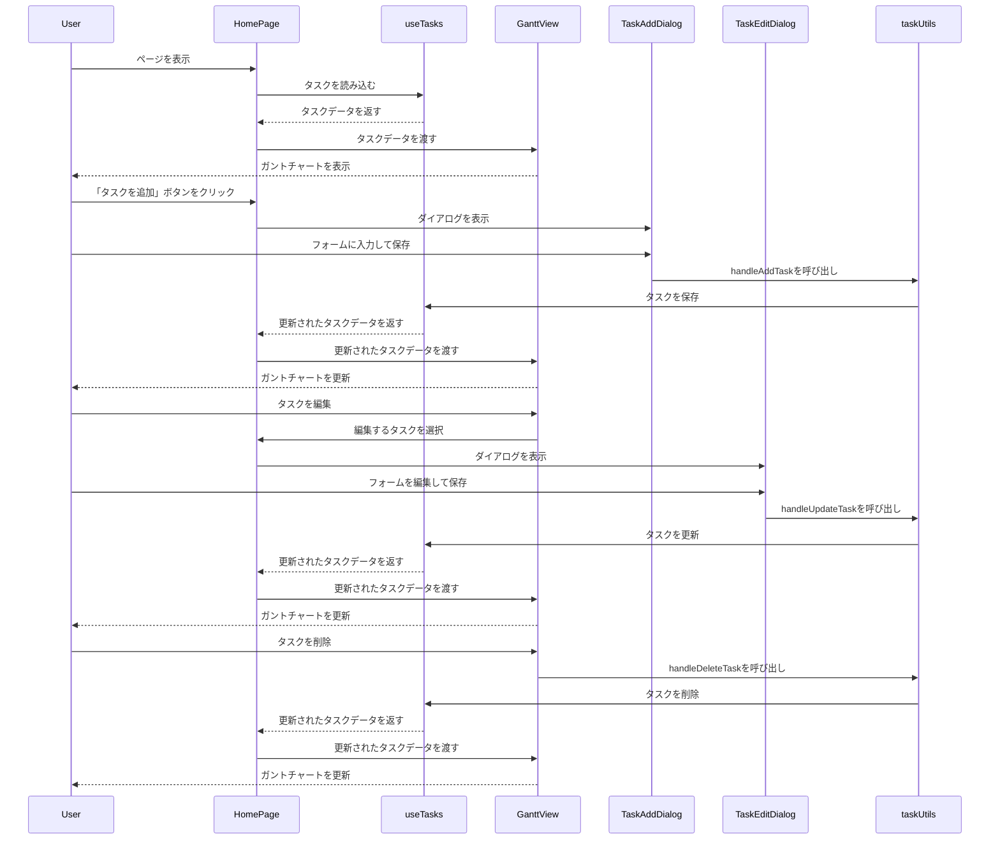

## 処理の流れ（DeepSeek 生成）

```mermaid

sequenceDiagram
    participant User
    participant HomePage
    participant useTasks
    participant GanttView
    participant TaskAddDialog
    participant TaskEditDialog
    participant taskUtils

    User->>HomePage: ページを表示
    HomePage->>useTasks: タスクを読み込む
    useTasks-->>HomePage: タスクデータを返す
    HomePage->>GanttView: タスクデータを渡す
    GanttView-->>User: ガントチャートを表示

    User->>HomePage: 「タスクを追加」ボタンをクリック
    HomePage->>TaskAddDialog: ダイアログを表示
    User->>TaskAddDialog: フォームに入力して保存
    TaskAddDialog->>taskUtils: handleAddTaskを呼び出し
    taskUtils->>useTasks: タスクを保存
    useTasks-->>HomePage: 更新されたタスクデータを返す
    HomePage->>GanttView: 更新されたタスクデータを渡す
    GanttView-->>User: ガントチャートを更新

    User->>GanttView: タスクを編集
    GanttView->>HomePage: 編集するタスクを選択
    HomePage->>TaskEditDialog: ダイアログを表示
    User->>TaskEditDialog: フォームを編集して保存
    TaskEditDialog->>taskUtils: handleUpdateTaskを呼び出し
    taskUtils->>useTasks: タスクを更新
    useTasks-->>HomePage: 更新されたタスクデータを返す
    HomePage->>GanttView: 更新されたタスクデータを渡す
    GanttView-->>User: ガントチャートを更新

    User->>GanttView: タスクを削除
    GanttView->>taskUtils: handleDeleteTaskを呼び出し
    taskUtils->>useTasks: タスクを削除
    useTasks-->>HomePage: 更新されたタスクデータを返す
    HomePage->>GanttView: 更新されたタスクデータを渡す
    GanttView-->>User: ガントチャートを更新

```
